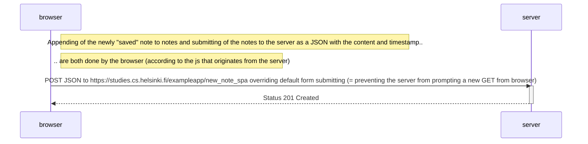

# Exercise 0.6: New note in single page app - diagram
- source: https://fullstackopen.com/en/part0/fundamentals_of_web_apps#loading-a-page-containing-java-script-review

```mermaid
sequenceDiagram
    participant browser
    participant server

Note right of browser: Appending of the newly "saved" note to notes and submitting of the notes to the server as a JSON with the content and timestamp..
Note right of browser: .. are both done by the browser (according to the js that originates from the server)

browser->>server: POST JSON to https://studies.cs.helsinki.fi/exampleapp/new_note_spa overriding default form submitting (= preventing the server from prompting a new GET from browser)
    activate server
    server-->>browser: Status 201 Created
    deactivate server


```
