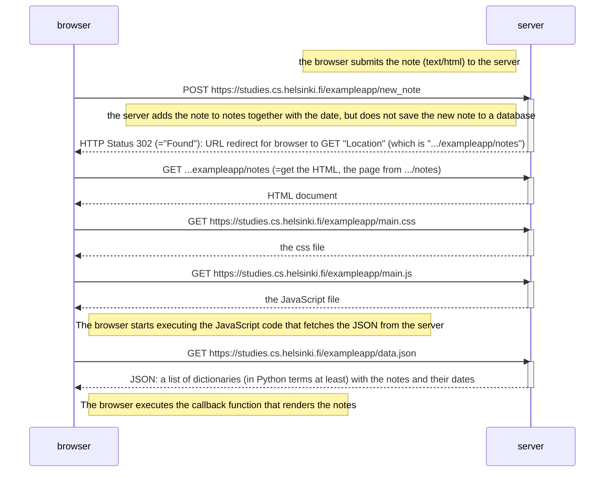

# Exercise 0.4: New note diagram
- The part starting from GET ...exampleapp/notes is adapted from the course material (to get the full picture better)
- source: https://fullstackopen.com/en/part0/fundamentals_of_web_apps#loading-a-page-containing-java-script-review

